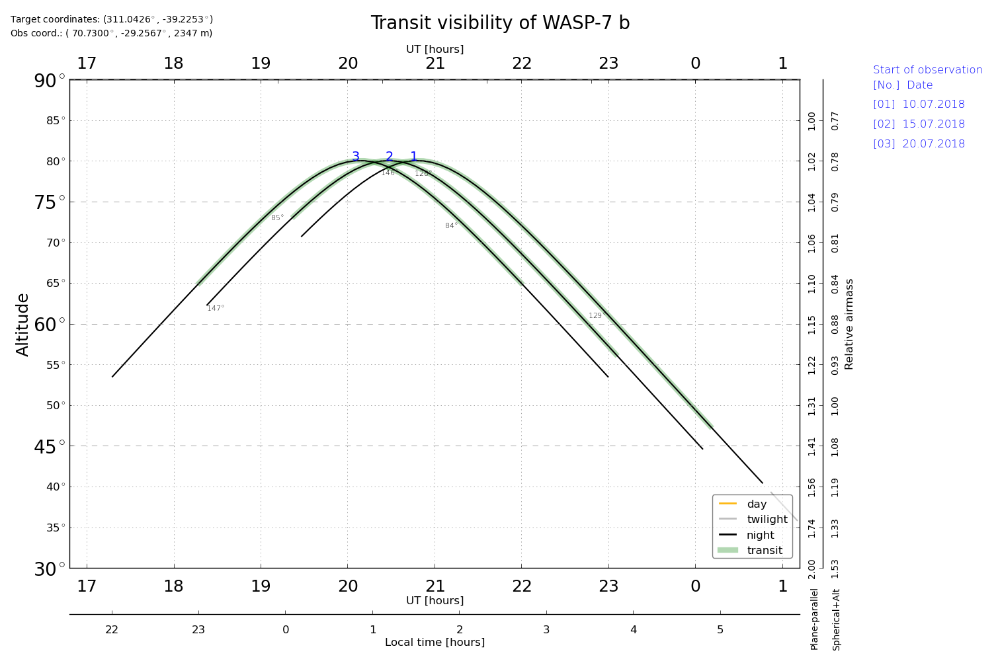

Transit visibility
====================

.. p23ready

.. currentmodule:: PyAstronomy.pyasl

The function :py:func:`transitTimes` provides a table containing, among others,
mid-transit times, altitude above horizon, and Moon distance and phase; i.e., the most relevant
information to evaluate whether a transit is observable at a particular point.

Using :py:func:`transitVisibilityPlot`, the data can be plotted to obtain a
visual impression of the visibility.

Example of usage
------------------

The following example demonstrates the use of the functions. Both
code and output is shown.

Code
~~~~~~

::

    from PyAstronomy import pyasl
    import datetime as dt
    
    # Get the data for WASP-7 from NEXA data base
    nexa = pyasl.NasaExoplanetArchive()
    dat = nexa.selectByPlanetName("Wasp-7 b")
    
    # Convert July 14th, 2018, 10pm to a Julian date
    d = dt.datetime(2018, 7, 14, 22)
    jd = pyasl.jdcnv(d)
    
    # Calculate transit data for transits within 100 days starting
    # form July 14th, 2018.
    dat = pyasl.transitTimes(jd, jd+100., dat, nexaInput=True, \
                             observatory="esoparanal", obsOffset=1./24., \
                             minAltitude=10.0)
    # Plot the result
    pyasl.transitVisibilityPlot(dat, markTransit=True)

Text output
~~~~~~~~~~~~

::

  Specified time span
  Start date (DDDD-MM-YY and fractional hours): 2018-07-14 21.962
  End date (DDDD-MM-YY and fractional hours): 2018-10-22 22.129
  
  Transit duration:  226.512  minutes
  Off-transit time before and after transit:  60.0  minutes
  
  No. Tmid [HJD]      Obs. start [UT] [ALT, DIR(AZI)]     Transit mid [UT] [ALT, DIR(AZI)]     Obs. end [UT] [ALT, DIR(AZI)]   twilight (SUN ALT)                   moon distance     moon phase
    1 2458394.66052    3.10.  0:57    [ 75°,S(193°)]       3.10.  3:51     [ 47°,W(238°)]       3.10.  6:44  [ 14°,W(233°)]                night (-30°,-59°,-46°)   (153°,154°,155°)   42%
    2 2458399.61518    7.10. 23:52    [ 74°,S(159°)]       8.10.  2:45     [ 56°,W(235°)]       8.10.  5:39  [ 22°,W(235°)]     astron. twilight (-15°,-50°,-55°)   (122°,121°,119°)    1%
    3 2458404.56984   12.10. 22:47    [ 68°,S(137°)]      13.10.  1:40     [ 64°,W(229°)]      13.10.  4:33  [ 31°,W(237°)]       civil twilight (  0°,-37°,-57°)   ( 60°, 58°, 57°)   18%
    4 2458409.52449   17.10. 21:42    [ 60°,E(127°)]      18.10.  0:35     [ 71°,S(214°)]      18.10.  3:28  [ 40°,W(238°)]                  day ( 14°,-23°,-52°)   ( 20°, 20°, 20°)   63%

Graphical output
~~~~~~~~~~~~~~~~~

The figure shows the product of the `transitVisibilityPlot` function.
In this case, four transits are shown in the form of altitude (or
airmass) as a function of UT and local time. The numbers indicate
to which transit the individual lines refer. The color of the thin
lines indicates the light conditions (e.g., twilight or astronomical night).
The green overlay indicates the time of transit; here, we have one hour of
additional time before and after the transit, which was specified on
the call to `transitTimes`. On the right, you see the dates at which the
*observation* (not necessarily the transit) starts.

API
--------

.. autofunction:: transitTimes

.. autofunction:: transitVisibilityPlot
